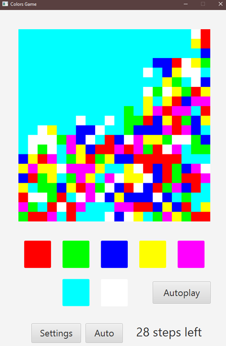

# Colors Game  

## Описание проекта
Это головоломка, основанная на популярной механике "наводнение" или "водопад". Задача игрока — закрасить всё игровое поле одним цветом за ограниченное количество ходов, выбирая цвета из доступных.  

## Основной функционал  
1. Настройка:  
   - Выбор количества цветов (от 3 до 7).  
   - Выбор размера поля (от 5x5 до 20x20).  
2. Автоматическое вычисление допустимого количества ходов на основе размеров поля и количества цветов.  
3. Механика игры:  
   - При выборе цвета меняется цвет верхнего левого квадрата и всех соседних (по горизонтали и вертикали), имеющих такой же цвет.  
4. Управление:  
   - Под игровым полем находятся кнопки, окрашенные в доступные цвета, для выбора.  

## Системные требования  
- Windows OS (тестировалось на Windows 10).  

---  
